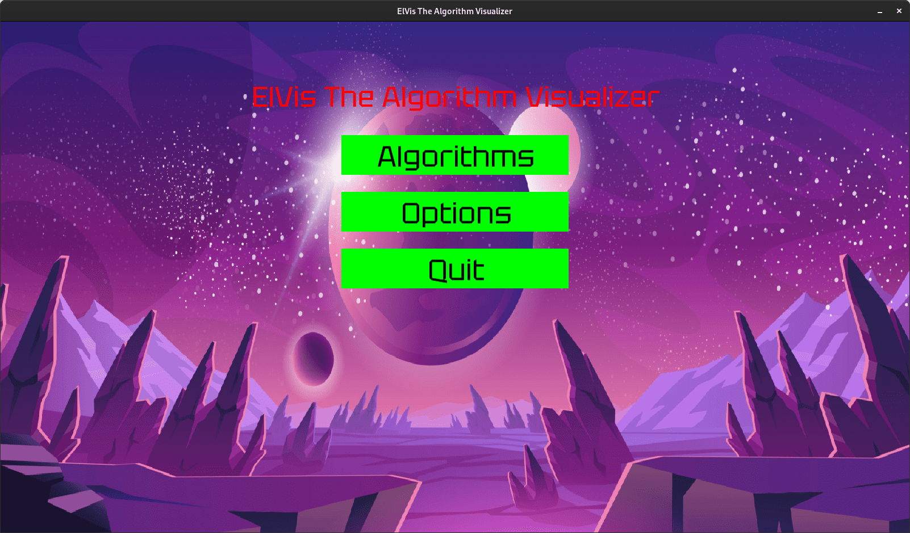
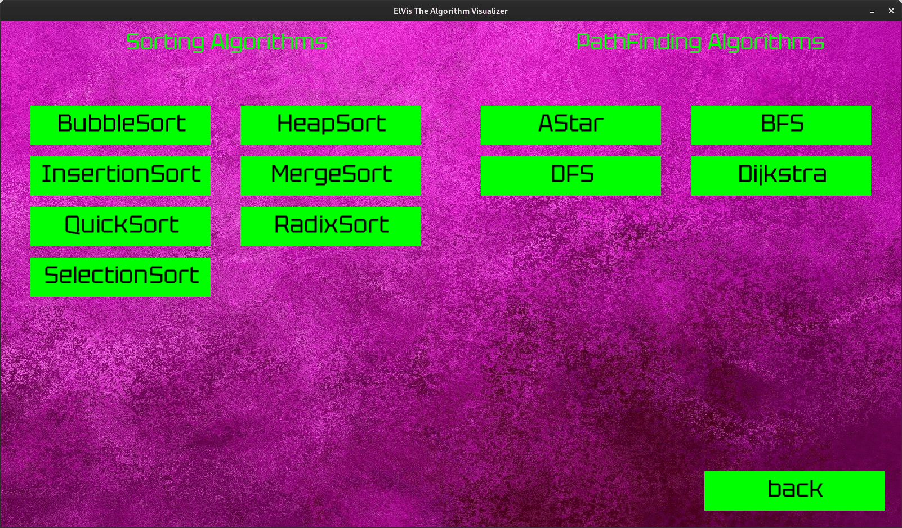
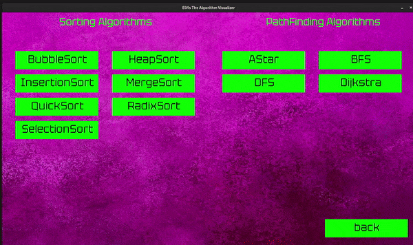

# ElVis - The Algorithm Visualizer

ElVis is a C++ project aimed at visualizing various algorithms using the SFML (Simple and Fast Multimedia Library). It provides an interactive and engaging platform to observe the inner workings of different algorithms, making it easier to understand their behavior and performance characteristics.


## Table of Contents
- [Features](#features)
- [Prerequisites](#prerequisites)
- [Installation](#installation)
- [Usage](#usage)
- [Supported Algorithms](#supported-algorithms)
- [Authors](#authors)

## Features
- Real-time visualization of algorithms
- Multiple sorting algorithms 
- (TODO) Pathfinding algorithms for graph traversal and shortest path finding

## Prerequisites
- C++ compiler (supporting C++11 or later)
- SFML library (version 2.5.1 or later)
- CMake (version 3.12 or later)

## Installation
1. Clone the repository:
   ```shell
   git clone https://github.com/ABitAtATime/ElVis-2.git
   ```
2. Create a build directory
   ```shell
   cd ElVis-2
   mkdir build
   cd build
   ```
3. Generate build files using cmake
   ```shell
   cmake ..
   ```
4. Build the project using make
   ```shell
   make
   ```

## Usage
1. Run the executable
   ```shell
   ./bin/ElVis
   ```
### Previews

Here is a preview of our **Home Screen**
(The Options doesn't work for now.)


And here is the screen for selecting Algorithms
(Not all algorithms listed here works see [Supported Algorithms] to see which algorithm we have implemented.)



---
*And finally here is heap sort in action*


## Supported Algorithms
### Sorting Algorithms
- Bubble Sort ✓
- Merge Sort ✓
- Quick Sort ✓
- Selection Sort ✓
- Insertion Sort ✓
- Heap Sort ✓
- Radix Sort ✓
### Pathfinding Algorithms
- Breadth-First Search (BFS) 
- Depth-First Search (DFS)
- A* (A-star) Search
- Dijkstra's Algorithm

Note: Only the algorithms with ✓ are implemented as of last commit.


## Authors
- [Sandeep Poudel](https://github.com/sandeep-poudel)
- [Sandesh Pokharel](https://github.com/hsednass)
- [Sudesh Subedi](https://github.com/sudeshsubedi)
